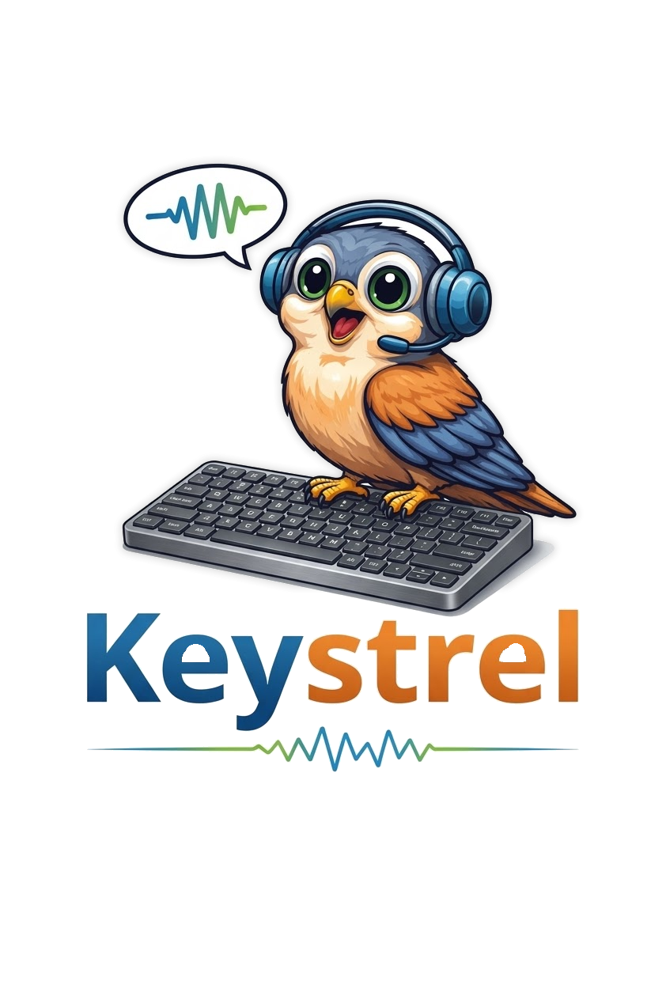
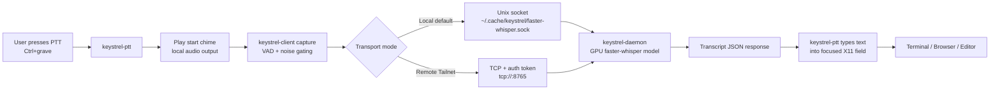

# Keystrel Quickstart and Operating Guide



This project provides local, GPU-accelerated speech-to-text for Linux X11 workflows, with push-to-talk behavior that can type into any focused X11 text field (terminal, browser, editor, chat apps, and more).

For deep implementation history and agent handoff context, read `docs/AGENTS.md`.
For command-only reference, use `docs/CHEATSHEET.md`.
For repeatable verification and smoke checks, use `docs/TESTING.md`.

## What You Get

- Persistent `faster-whisper` backend on NVIDIA GPU for low latency after warm-up.
- Microphone capture client with auto-stop on trailing silence.
- Audible start chime before each listen cycle so nearby people can tell dictation is active.
- Optional mute of all audio output during listening to reduce feedback contamination.
- Push-to-talk helper that types transcript text directly into the focused X11 window.
- Desktop global hotkey integration for practical day-to-day use.
- Works in browser text areas, web chat inputs, IDE/editor fields, terminal prompts, and other focused text boxes.

## Current Runtime State

- Desktop/session requirement: X11 (for `xdotool` typing injection).
- Backend model defaults: English-focused `large-v3` with stronger decoding search.
- Keybinding example: `Ctrl+grave` runs `$HOME/.local/bin/keystrel-ptt`.

## Naming Migration

- Primary commands are now `keystrel-daemon`, `keystrel-client`, and `keystrel-ptt`.
- Preferred environment variable prefix is `KEYSTREL_`.
- Legacy `STT_` environment variables are still accepted for backward compatibility.

## High-Level Architecture

There are 3 layers:

1. `keystrel-daemon` (always-on backend)
   - Loads Whisper model once and keeps it warm in VRAM.
   - Accepts requests over Unix socket and optional TCP (for Tailnet clients).
   - Returns transcript JSON.

2. `keystrel-client` (capture/transcribe command)
   - Records mic audio.
   - Plays a short start chime before muting and listening.
   - Applies speech gating to reject environmental noise.
   - Sends local WAV path over Unix socket or WAV bytes to remote TCP server.
   - Prints transcript to stdout.

3. `keystrel-ptt` (desktop typing integration)
   - Calls `keystrel-client`.
   - Cleans transcript text.
   - Types text into active window via `xdotool`.
   - Optional Enter key submit.

## System Flow Chart



## Repository Layout

This repository keeps only project-local paths and templates:

- `lib/` Python implementation (`keystrel_client.py`, `keystrel_daemon.py`)
- `bin/` CLI wrappers (`keystrel-client`, `keystrel-daemon`, `keystrel-ptt`)
- `config/` example daemon env configuration
- `venv/` venv activation helper
- `keystrel-client.env.example` remote client environment template
- `docs/` supplemental docs and project mascot image

Runtime install locations (user home paths, service unit paths, and machine-specific env files) are intentionally not listed here.

## Prerequisites and Installed Dependencies

APT packages used:

- `libportaudio2`
- `pulseaudio-utils` (for `pactl`)
- `xdotool`
- `ffmpeg` (already present and useful for tests)

Python packages in Keystrel venv include:

- `faster-whisper`
- `ctranslate2`
- `sounddevice`
- `soundfile`
- `webrtcvad-wheels`
- `nvidia-cublas-cu12`
- `nvidia-cudnn-cu12`

## Automated Testing

Run unit tests (no microphone/GPU required):

```bash
python -m unittest discover -s tests -v
```

Run syntax checks for main scripts:

```bash
python -m py_compile lib/keystrel_client.py lib/keystrel_daemon.py
```

For full manual local and Tailnet smoke testing, see `docs/TESTING.md`.

## Service Management

Daemon service is managed by user systemd.

Check status:

```bash
systemctl --user status keystrel-daemon
```

Restart service:

```bash
systemctl --user restart keystrel-daemon
```

View logs live:

```bash
journalctl --user -u keystrel-daemon -f
```

## Centralized GPU over Tailscale

You can run one GPU daemon for your Tailnet and use lightweight clients from other machines.
No separate server app is required; the same `keystrel-daemon` process can expose both transports.

### Server node (GPU host)

Set in `$HOME/.config/keystrel-daemon.env`:

```dotenv
KEYSTREL_SOCKET=~/.cache/keystrel/faster-whisper.sock
KEYSTREL_TCP_LISTEN=<tailscale-ip>
KEYSTREL_TCP_PORT=8765
KEYSTREL_SERVER_TOKEN=REPLACE_WITH_LONG_RANDOM_SECRET
KEYSTREL_MAX_REQUEST_BYTES=10485760
KEYSTREL_MAX_AUDIO_BYTES=6291456
```

Use `tailscale ip -4` on the GPU node to get `<tailscale-ip>`.

Then restart daemon:

```bash
systemctl --user restart keystrel-daemon
```

### Client node (any Tailnet machine)

Set client env (shell profile or launcher env):

```bash
export KEYSTREL_SERVER="tcp://<tailscale-ip>:8765"
export KEYSTREL_SERVER_TOKEN="REPLACE_WITH_SAME_SECRET"
```

You can also start from the provided template:

```bash
cp keystrel-client.env.example .env
```

`keystrel-client` and `keystrel-ptt` then keep local capture/chime/typing, while transcription runs on the remote GPU daemon.

## Quickstart (Daily Usage)

1. Ensure daemon is running:

```bash
systemctl --user status keystrel-daemon
```

2. Optional device check:

```bash
keystrel-client --list-devices
```

3. Test direct transcription path:

```bash
keystrel-client --verbose
```

4. Use push-to-talk in any focused text field:

- Focus a text input (terminal, browser, editor, etc.).
- Press `Ctrl+grave` once.
- You should hear a short start chime.
- Speak naturally.
- Pause briefly at sentence end.
- Transcript should be typed into the focused window.

## Where PTT Works

Because `keystrel-ptt` uses `xdotool type`, it targets the currently focused X11 window.

Common targets:

- Terminal prompts (X11 terminals)
- Browser text fields (search boxes, chat inputs, form text areas)
- Editor and IDE inputs
- Desktop chat apps with standard text input fields

Practical note:

- Click/focus the exact field first, then trigger hotkey.
- If a non-text UI control has focus, typing may be ignored or go to the wrong place.

## Start Chime Behavior

`keystrel-client` plays an audible chime right before output muting and microphone capture.

Chime backend selection:

- `auto` (default): prefer direct PipeWire playback (`pw-play`), then `paplay`, then synthesized tone, then `canberra`.
- `pipewire`: direct `pw-play` chime path (best fit for modern Linux desktops).
- `paplay`: plays a bell audio file directly.
- `canberra`: uses desktop event/file playback.
- `sounddevice`: generated high-frequency chirp.

PTT convenience behavior:

- With `pipewire` backend and no `KEYSTREL_CHIME_TARGET`, `pw-play` uses PipeWire auto-target routing.

Why this exists:

- Signals intent to people nearby so dictation is less likely to be mistaken for normal conversation.
- Gives immediate feedback that the hotkey was accepted.

Default order of operations:

1. Play chime.
2. Optional short cooldown.
3. Mute output sinks (if enabled).
4. Record and transcribe.
5. Restore sink mute state.

## How `keystrel-client` Detects Speech

The client uses layered gating to avoid triggering on fan noise/hum.

1. WebRTC VAD frame classification
   - Audio is split into small frames (default 20 ms).
   - VAD marks each frame as speech/non-speech.

2. Speech ratio threshold per block
   - For each block, voiced frame ratio must reach `--speech-ratio`.

3. Consecutive speech chunks requirement
   - Requires `--start-speech-chunks` positive blocks before capture starts.

4. Pre-roll buffering
   - Keeps short audio history (`--pre-roll-seconds`) so first words are not cut off.

5. Trailing silence stop
   - Once speech started, stops after `--silence-seconds` of inactivity.

Fallback behavior:

- If WebRTC VAD is unavailable or unsupported at the selected sample rate, it falls back to adaptive RMS thresholding.

## How Output Muting Works

When enabled (default), `keystrel-client`:

1. Plays the start chime.
2. Enumerates output sinks with `pactl`.
3. Stores each sink's current mute state.
4. Mutes sinks for the capture window.
5. Restores every sink to its original mute state in a `finally` block.

This prevents speaker audio from being interpreted as mic speech and reduces false triggers.

## Concurrency and Repeat Protection

Two lock layers prevent race conditions and repeated delayed output:

- `keystrel-client` lock (`~/.cache/keystrel/keystrel-client.lock`)
  - Prevents overlapping captures from racing sink state.

- `keystrel-ptt` lock + debounce (`keystrel-ptt.lock`, `keystrel-ptt.last`)
  - Prevents key auto-repeat from launching many concurrent jobs.

## Configuration

### Daemon configuration file

Edit `$HOME/.config/keystrel-daemon.env`.

Current defaults:

```dotenv
KEYSTREL_MODEL=large-v3
KEYSTREL_DEVICE=cuda
KEYSTREL_COMPUTE_TYPE=float16
KEYSTREL_BEAM_SIZE=5
KEYSTREL_BEST_OF=5
KEYSTREL_VAD_FILTER=1
KEYSTREL_LANGUAGE=en
KEYSTREL_SOCKET=~/.cache/keystrel/faster-whisper.sock
KEYSTREL_TCP_LISTEN=<tailscale-ip>
KEYSTREL_TCP_PORT=8765
KEYSTREL_SERVER_TOKEN=REPLACE_WITH_LONG_RANDOM_SECRET
KEYSTREL_MAX_REQUEST_BYTES=10485760
KEYSTREL_MAX_AUDIO_BYTES=6291456
```

After edits, restart daemon:

```bash
systemctl --user restart keystrel-daemon
```

### Client tuning flags (most important)

- `--webrtcvad` / `--no-webrtcvad`
- `--webrtcvad-mode {0,1,2,3}` (higher = stricter)
- `--speech-ratio` (higher = stricter)
- `--start-speech-chunks` (higher = stricter)
- `--pre-roll-seconds` (larger = safer word onset)
- `--silence-seconds` (larger = waits longer before stopping)
- `--threshold` and `--noise-multiplier` (fallback RMS path)
- `--socket-timeout` (bounds daemon request wait time)
- `--server` (remote endpoint, e.g. `tcp://<tailscale-ip>:8765`)
- `--server-token` (shared token for remote TCP mode)
- `--server-timeout` (bounds remote connect/read wait time)
- `--mute-start-delay-ms` (delay output muting after capture starts)
- `--start-chime` / `--no-start-chime`
- `--chime-backend {auto,pipewire,paplay,canberra,sounddevice}`
- `--chime-file` (audio file for paplay/canberra backends)
- `--chime-sink` (optional sink name/id for paplay)
- `--chime-target` (optional PipeWire target node serial/name)
- `--chime-role` (PipeWire media role, default `Music`)
- `--chime-event-id` (desktop event id for canberra)
- `--chime-freq-hz`, `--chime-duration-ms`, `--chime-volume`, `--chime-cooldown-ms`

### PTT behavior env vars

- `KEYSTREL_PTT_DEBOUNCE_MS` (default `0`)
- `KEYSTREL_TYPE_DELAY_MS` (default `1`)
- `KEYSTREL_PTT_SEND_ENTER` (`1` to press Enter after typing)
- `KEYSTREL_CLIENT_BIN` (override client path)
- `KEYSTREL_SERVER` (remote endpoint, e.g. `tcp://<tailscale-ip>:8765`)
- `KEYSTREL_SERVER_TOKEN` (shared token for remote mode)
- `KEYSTREL_SERVER_TIMEOUT` (remote connect/read timeout)
- `KEYSTREL_MUTE_START_DELAY_MS` (delay mute start; useful for Bluetooth chime audibility)
- `KEYSTREL_START_CHIME` (`1`/`0`)
- `KEYSTREL_CHIME_BACKEND` (`auto`, `pipewire`, `paplay`, `canberra`, `sounddevice`)
- `KEYSTREL_CHIME_FILE` (default `/usr/share/sounds/freedesktop/stereo/bell.oga`)
- `KEYSTREL_CHIME_SINK` (optional explicit sink, e.g. `@DEFAULT_SINK@`)
- `KEYSTREL_CHIME_TARGET` (optional PipeWire target node)
- `KEYSTREL_CHIME_ROLE` (PipeWire media role, default `Music`)
- `KEYSTREL_CHIME_EVENT_ID` (default `bell`)
- `KEYSTREL_CHIME_FREQ_HZ`, `KEYSTREL_CHIME_DURATION_MS`, `KEYSTREL_CHIME_VOLUME`, `KEYSTREL_CHIME_COOLDOWN_MS`

### Wrapper override env vars

Useful if runtime files are relocated:

- `KEYSTREL_ENV_FILE` (used by `keystrel-client` and `keystrel-daemon` wrappers)
- `KEYSTREL_CLIENT_PY` (override Python client script path)
- `KEYSTREL_DAEMON_PY` (override Python daemon script path)
- `KEYSTREL_SOCKET_TIMEOUT` (default client daemon-request timeout)
- `KEYSTREL_VENV_DIR` (override venv location used by `venv/env.sh`)

## Tuning Recipes

### Balanced default (current)

Good mix of sensitivity and noise rejection:

```bash
keystrel-client --verbose --webrtcvad-mode 2 --speech-ratio 0.60 --start-speech-chunks 2
```

### Noisy environment (stricter)

```bash
keystrel-client --verbose --webrtcvad-mode 3 --speech-ratio 0.72 --start-speech-chunks 3
```

### If phrases are being missed (more permissive)

```bash
keystrel-client --verbose --webrtcvad-mode 1 --speech-ratio 0.50 --start-speech-chunks 1
```

### Longer pause before auto-stop

```bash
keystrel-client --silence-seconds 1.2
```

### Use a specific microphone

```bash
keystrel-client --list-devices
keystrel-client --device 6 --verbose
```

### Disable mute for one run

```bash
keystrel-client --no-mute-output
```

### Disable chime for one run

```bash
keystrel-client --no-start-chime
```

### Lower-volume shorter chime

```bash
keystrel-client --chime-volume 0.10 --chime-duration-ms 80
```

### Force direct PipeWire playback (recommended on modern Linux desktops)

```bash
keystrel-client --chime-backend pipewire --chime-file "$HOME/.local/share/keystrel/chime_hi.wav"
```

If your notification stream is suppressed, use a role with normal playback priority:

```bash
keystrel-client --chime-backend pipewire --chime-role Music
```

### Force direct bell-file playback (paplay)

```bash
keystrel-client --chime-backend paplay --chime-file /usr/share/sounds/freedesktop/stereo/bell.oga
```

### Target a specific output sink for chime

```bash
keystrel-client --chime-backend paplay --chime-sink @DEFAULT_SINK@
```

### Force desktop event backend

```bash
keystrel-client --chime-backend canberra --chime-event-id bell
```

## Global Hotkey Notes

Current binding points to:

- `$HOME/.local/bin/keystrel-ptt`

Use your desktop's global hotkey settings to run `$HOME/.local/bin/keystrel-ptt`.
PTT will type into whichever X11 window currently has keyboard focus.

Recommended hotkey behavior:

```bash
# command: $HOME/.local/bin/keystrel-ptt
# binding: Ctrl+grave (or any preferred global hotkey)
```

Conflict note:

- Some applications may still have app-local meaning for `Ctrl+grave`.

## Troubleshooting

No transcript appears:

- Check daemon: `systemctl --user status keystrel-daemon`
- Check logs: `journalctl --user -u keystrel-daemon -n 80 --no-pager`
- Test client directly: `keystrel-client --verbose`
- Verify socket exists: `$HOME/.cache/keystrel/faster-whisper.sock`
- Expected secure permissions: socket dir `drwx------`, socket file `srw-------`

Remote mode issues (`KEYSTREL_SERVER` set):

- Verify TCP listener on server node: `ss -ltn | rg 8765`
- Verify Tailnet reachability: `tailscale ping <tailscale-ip>`
- Verify token match on both sides: `KEYSTREL_SERVER_TOKEN`
- Force explicit call: `KEYSTREL_SERVER=tcp://<tailscale-ip>:8765 KEYSTREL_SERVER_TOKEN=... keystrel-client --verbose --no-start-chime`

PTT key does nothing:

- Confirm hotkey command path is `$HOME/.local/bin/keystrel-ptt`.
- Confirm `xdotool` exists: `xdotool -v`.
- Confirm session is X11: `echo "$XDG_SESSION_TYPE"`.

No start chime heard:

- Confirm chime is enabled (`KEYSTREL_START_CHIME` not set to `0`).
- Confirm system output is not already muted at desktop level.
- Test directly: `keystrel-client --verbose --max-seconds 0.5`.
- Force PipeWire path: `keystrel-client --verbose --chime-backend pipewire --max-seconds 0.5`.
- Force bell-file path: `keystrel-client --verbose --chime-backend paplay --max-seconds 0.5`.
- Force desktop event sound path: `keystrel-client --verbose --chime-backend canberra --max-seconds 0.5`.
- Check routing: `pactl info | rg "Default Sink"` and set `--chime-sink` / `KEYSTREL_CHIME_SINK` if needed.
- For PipeWire routing issues: set `KEYSTREL_CHIME_TARGET` to a concrete node name from `wpctl status`.
- If chime is clipped by immediate mute, set a tiny holdoff: `--chime-cooldown-ms 30` to `60`.

Too many false activations:

- Raise strictness:

```bash
keystrel-client --webrtcvad-mode 3 --speech-ratio 0.72 --start-speech-chunks 3
```

Speech frequently missed:

- Relax strictness:

```bash
keystrel-client --webrtcvad-mode 1 --speech-ratio 0.50 --start-speech-chunks 1
```

Audio output remains muted:

- Inspect sink states:

```bash
pactl list short sinks
pactl get-sink-mute <sink-id>
```

- Emergency unmute all sinks:

```bash
for s in $(pactl list short sinks | awk '{print $1}'); do pactl set-sink-mute "$s" 0; done
```

## Development Workflow Notes

When modifying behavior:

1. Edit active runtime files under `$HOME/.local/...`.
2. Validate Python syntax:

```bash
source "$HOME/.venvs/faster-whisper/env.sh"
python -m py_compile "$HOME/.local/lib/keystrel/keystrel_client.py" "$HOME/.local/lib/keystrel/keystrel_daemon.py"
```

3. Restart and verify daemon:

```bash
systemctl --user restart keystrel-daemon
systemctl --user status keystrel-daemon
```

4. Run smoke test:

```bash
keystrel-client --verbose --max-seconds 1.5
```

5. Sync mirror files into your repository workspace when needed.
