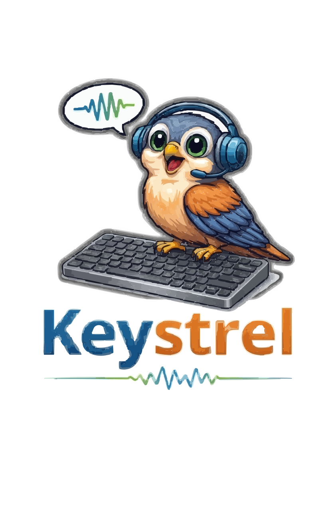

# Keystrel

<p align="center">
  
</p>

<p align="center">
  <strong>Local speech-to-text with push-to-talk typing for Linux X11 workflows.</strong>
</p>

Keystrel provides low-latency local transcription with a warm `faster-whisper` daemon, a microphone capture client, and a push-to-talk helper that types into the currently focused X11 text field.

## Highlights

- Persistent `faster-whisper` backend for low-latency reuse after warm-up.
- Push-to-talk workflow (`keystrel-ptt`) that types into focused terminal, browser, editor, and chat inputs.
- Output mute protection during capture to reduce speaker-to-mic contamination.
- Optional remote inference over Tailnet TCP while keeping local capture and typing behavior.
- Local-first tests and runtime tooling (no hosted CI required).

## Quickstart

1. Ensure the daemon is up:

```bash
systemctl --user restart keystrel-daemon
systemctl --user status keystrel-daemon
```

2. Verify microphone capture path:

```bash
keystrel-client --list-devices
keystrel-client --verbose
```

3. Use push-to-talk in any focused X11 text field:

```bash
keystrel-ptt
```

For complete setup, service operations, and remote/Tailscale flow, use the docs index below.

## Documentation

- [Documentation Index](docs/README.md) - start here
- [Operating Guide](docs/OPERATING_GUIDE.md) - architecture, runtime model, quickstart, service operations
- [Configuration and Tuning](docs/CONFIGURATION.md) - daemon/client/PTT settings and recipes
- [Troubleshooting](docs/TROUBLESHOOTING.md) - common failures and recovery commands
- [Cheat Sheet](docs/CHEATSHEET.md) - quick command reference
- [Testing Guide](docs/TESTING.md) - regression and smoke-test workflows

## Repository Layout

- `bin/` - wrapper scripts (`keystrel-client`, `keystrel-daemon`, `keystrel-ptt`)
- `lib/` - Python implementation (`keystrel_client.py`, `keystrel_daemon.py`)
- `config/` - daemon env template
- `docs/` - detailed project documentation
- `tests/` - local unit and behavior tests

## License

Keystrel is licensed under the Apache License 2.0. See `LICENSE` and `NOTICE`.
