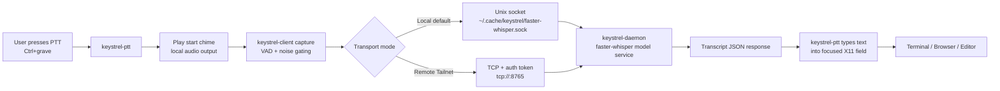

# Keystrel Operating Guide

This guide covers runtime behavior and day-to-day operation.
For tuning and environment variable reference, use `CONFIGURATION.md`.

## What You Get

- Persistent `faster-whisper` daemon for low latency after warm-up.
- Microphone capture client with voice gating and silence-based auto-stop.
- Start chime before each listen cycle so nearby people know capture is active.
- Optional output sink muting during capture to reduce feedback contamination.
- Push-to-talk helper that types transcript text into focused X11 windows.

## Runtime Assumptions

- Desktop/session requirement: X11 (needed for `xdotool` typing injection).
- Default model posture: English-focused `large-v3` with stronger decoding search.
- Typical hotkey: `Ctrl+grave` invoking `$HOME/.local/bin/keystrel-ptt`.

## High-Level Architecture

Keystrel has three layers:

1. `keystrel-daemon` (always-on backend)
   - Loads Whisper model once and keeps it warm in memory.
   - Accepts requests over Unix socket and optional TCP.
   - Returns transcript JSON.

2. `keystrel-client` (capture/transcribe command)
   - Records microphone audio.
   - Plays start chime and applies output mute controls.
   - Applies speech gating and silence stop behavior.
   - Sends local WAV path to Unix daemon or WAV bytes to remote TCP daemon.

3. `keystrel-ptt` (desktop typing integration)
   - Runs `keystrel-client`.
   - Sanitizes transcript output.
   - Types into active X11 window with `xdotool`.
   - Optionally sends Enter.

## System Flow



## Repository Layout

- `lib/` Python implementation (`keystrel_client.py`, `keystrel_daemon.py`)
- `bin/` wrapper scripts (`keystrel-client`, `keystrel-daemon`, `keystrel-ptt`)
- `config/` daemon env template
- `venv/` activation helper
- `keystrel-client.env.example` client env template
- `docs/` documentation and mascot image

## Prerequisites

APT packages:

- `libportaudio2`
- `pulseaudio-utils`
- `xdotool`
- `ffmpeg` (useful for diagnostics and testing)

Python packages in Keystrel venv include:

- `faster-whisper`
- `ctranslate2`
- `sounddevice`
- `soundfile`
- `webrtcvad-wheels`

## Service Management

Check status:

```bash
systemctl --user status keystrel-daemon
```

Restart:

```bash
systemctl --user restart keystrel-daemon
```

Tail logs:

```bash
journalctl --user -u keystrel-daemon -f
```

## Centralized Inference over Tailscale

The same daemon can expose both Unix socket and TCP transports.

### Server node

Set in `$HOME/.config/keystrel-daemon.env`:

```dotenv
KEYSTREL_SOCKET=~/.cache/keystrel/faster-whisper.sock
KEYSTREL_TCP_LISTEN=<tailscale-ip>
KEYSTREL_TCP_PORT=8765
KEYSTREL_SERVER_TOKEN=REPLACE_WITH_LONG_RANDOM_SECRET
KEYSTREL_MAX_REQUEST_BYTES=10485760
KEYSTREL_MAX_AUDIO_BYTES=6291456
```

Get `<tailscale-ip>`:

```bash
tailscale ip -4
```

Restart daemon:

```bash
systemctl --user restart keystrel-daemon
```

### Client node

Set env:

```bash
export KEYSTREL_SERVER="tcp://<tailscale-ip>:8765"
export KEYSTREL_SERVER_TOKEN="REPLACE_WITH_SAME_SECRET"
```

Optional template:

```bash
cp keystrel-client.env.example .env
```

## Quickstart (Daily Use)

1. Ensure daemon is running.

```bash
systemctl --user status keystrel-daemon
```

2. Optional device check.

```bash
keystrel-client --list-devices
```

3. Validate direct transcription.

```bash
keystrel-client --verbose
```

4. Use push-to-talk in any focused text field.

- Focus a text input.
- Trigger hotkey (or run `keystrel-ptt`).
- Speak.
- Pause briefly.
- Transcript is typed into focused window.

## Where PTT Works

Because `keystrel-ptt` uses `xdotool type`, it targets the active X11 text input.

Common targets:

- terminal prompts
- browser text boxes and form fields
- editor/IDE inputs
- desktop chat apps with standard text fields

## Start Chime Behavior

`keystrel-client` chime backends:

- `auto` (default): `pipewire` -> `paplay` -> `sounddevice` -> `canberra`
- `pipewire`
- `paplay`
- `canberra`
- `sounddevice`

Default ordering around capture:

1. Play chime.
2. Optional cooldown.
3. Apply output mute (if enabled).
4. Confirm mute state (bounded window).
5. Capture and transcribe.
6. Restore original sink mute states.

## Speech Detection Behavior

`keystrel-client` uses layered gating:

1. WebRTC VAD frame classification.
2. Speech ratio threshold per block.
3. Consecutive positive blocks before speech start.
4. Pre-roll buffering to avoid clipped first words.
5. Trailing silence stop after speech starts.

Fallback path uses adaptive RMS thresholding when WebRTC VAD is unavailable.

## Output Muting Behavior

When enabled, client logic:

1. Enumerates sinks with `pactl`.
2. Snapshots each sink mute state.
3. Mutes sinks that were unmuted.
4. Persists changed sinks to `~/.cache/keystrel/keystrel-mute-transaction.json`.
5. Restores sink states in a `finally` block with timeout/retry safeguards.
6. If restore is incomplete, keeps unresolved sink state for next-run recovery.

Timeout note:

- `pactl` mute-control timeout defaults to `1.0s` and can be tuned with `KEYSTREL_PACTL_TIMEOUT_S`.

Startup behavior:

- Before normal capture, `keystrel-client` attempts stale mute-state recovery.
- `keystrel-unmute` runs recovery-only mode and exits.

## Concurrency and Repeat Protection

- `keystrel-client` lock: `~/.cache/keystrel/keystrel-client.lock`
  - prevents overlapping capture runs from racing sink state.

- `keystrel-ptt` lock + debounce:
  - lock: `${XDG_RUNTIME_DIR:-$HOME/.cache/keystrel}/keystrel-ptt.lock`
  - debounce stamp: `${XDG_RUNTIME_DIR:-$HOME/.cache/keystrel}/keystrel-ptt.last`
  - prevents key-repeat fan-out.
  - second press while active requests cancel by default.
  - cancel request path uses a debounce window to ignore repeat-key noise.

## Global Hotkey Notes

- Typical command target: `$HOME/.local/bin/keystrel-ptt`
- Typical binding: `Ctrl+grave`

Some apps may have app-local bindings on the same key combo.

## Development Workflow Notes

Project source of truth is this repository.
Runtime launchers under `$HOME/.local/bin/` may be symlinked to `bin/` and `lib/` here.

After code changes:

```bash
python -m py_compile lib/keystrel_client.py lib/keystrel_daemon.py
python -m unittest discover -s tests -v
systemctl --user restart keystrel-daemon
```
